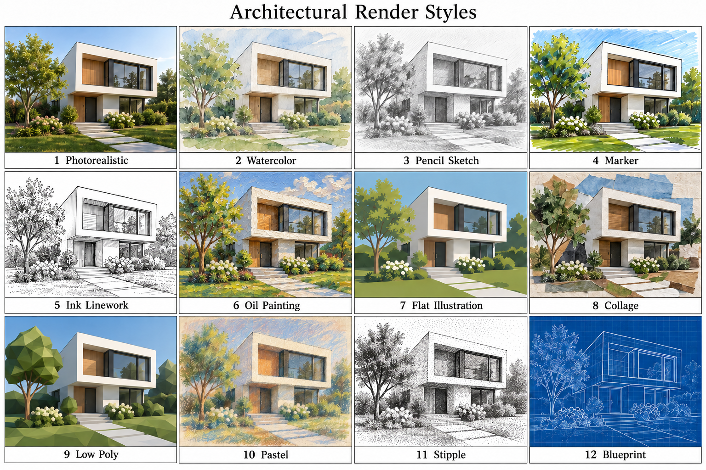

<p>
<br />

</p>

[](LICENSE)
[](skills/)
[](https://www.blender.org/lab/mcp-server/)
[](.codex/INSTALL.md)
[](.claude/INSTALL.md)

# Blender Skills for Codex and Claude Code

Create, refine, and render 3D assets with thirteen reusable Blender skills.<br />
Shared sources live in [skills/](skills/), with client packages in [.codex/](.codex/INSTALL.md) and [.claude/](.claude/INSTALL.md).

> [!IMPORTANT]
> Skills designed to work with the existing [official Blender Lab MCP](https://www.blender.org/lab/mcp-server/).

## Images

### Screenshots

Reference sheets from the optional gallery (inspiration, not generated project output):

<a href="references/renders/render_architecture_v1.png"></a>
<a href="references/renders/render_character_v1.png"></a>

[Visual references](references/) contains the original 20 PNGs in camera, colors, lighting and renders. Textual styles remain usable without the optional gallery.

## Live Demo

Coming Soon...

## Table of Contents

1. [Images](#images)
2. [Live Demo](#live-demo)
3. [Getting Started](#getting-started)
4. [Project Details](#project-details)
5. [Credits](#credits)

## Getting Started

Here are the steps.

### 1. 🛠 Install Blender

1. Install Blender from [blender.org](https://www.blender.org/download/).

### 2. 🛠 Setup Blender MCP

1. Follow the [official Blender MCP setup](https://www.blender.org/lab/mcp-server/) for your AI client.

### 3. 🛠 Install Skills

#### A. Codex

1. Copy the skill folders from [.codex/skills](.codex/skills/) into `~/.agents/skills/`.

Or run this command from the repository in PowerShell:

```powershell
./scripts/install-codex.ps1 -Scope User -Skills all
```

#### B. Claude

1. Copy the skill folders from [.claude/skills](.claude/skills/) into `~/.claude/skills/`.

Or run this command from the repository in PowerShell:

```powershell
./scripts/install-claude.ps1 -Scope User -Skills all
```

### 4. 🛠 Use Skills

1. Run `$blender-setup` in Codex or `/blender-setup` in Claude Code.
2. Request a task, such as `Render the current scene.`

## Project Details

Windows/Codex has live Blender validation. Claude packaging and installation are tested; a full Claude session is not yet verified. Other platforms are not yet verified. Source content remains portable and avoids personal configuration paths.

### 📝 Structure

- `skills/`: shared authoring sources for thirteen skills.
- `.codex/skills/`: generated Codex package with OpenAI metadata.
- `.claude/skills/`: generated Claude package with a client-specific setup workflow.
- `scripts/`: installation and development validation tools.
- `references/`: the original camera, colors, lighting and renders directories.
- `docs/`: input guidance, helper interfaces, source provenance and validation evidence.

Local tests, OpenSpec planning, generated acceptance outputs, environments and caches are excluded from Git. Intentional future PNG references and Blender source assets are not blanket-ignored.

### 📦 AI

Both clients use `SKILL.md` and supporting resources. The Codex package also includes `agents/openai.yaml`; the Claude package adapts setup to Claude MCP and omits Codex-only metadata. Run `python scripts/sync-client-skills.py` after editing shared sources, and `python scripts/sync-client-skills.py --check` to verify the mirrors. Supporting resources stay with their owning skill so individual installation works.

The optional shared gallery is loaded only when useful. Select a reference by filename and inspect the image before applying its visual characteristics. See [input conventions](docs/inputs.md) and [helper interfaces](docs/helpers.md).

Claude uses `/skill-name` for the same catalog shown below with Codex `$skill-name` syntax.

#### Skill Catalog

| Name | Comment | Call Directly? |
|---|---|---|
| `$blender-setup` | Check the Blender connection and diagnose setup issues | Yes |
| `$blender-create-model` | Create a prop or character | Yes |
| `$blender-create-environment` | Build a room, landscape, or modular scene | Yes |
| `$blender-procedural-geometry` | Build editable generators and repeated geometry | When needed |
| `$blender-materials` | Create or refine surface materials | When needed |
| `$blender-uv-bake` | Unwrap meshes and bake texture maps | When needed |
| `$blender-light-camera` | Refine lighting and camera composition | When needed |
| `$blender-render` | Render the current scene and verify outputs | Yes |
| `$blender-rig-animate` | Rig an asset or create animation clips | Yes |
| `$blender-game-export` | Export an asset for a game engine | Yes |
| `$blender-review-optimize` | Review asset quality and reduce rendering or geometry cost | When needed |
| `$blender-convert-3d-2d` | Render a model into sprites or other 2D views | Yes |
| `$blender-convert-2d-3d` | Reconstruct a model from an image | Yes |

**Yes** marks a common starting point. **When needed** marks a specialist task that can also support a larger workflow. All skills can be called directly; these labels are guidance, not invocation restrictions. The AI can select relevant installed skills, but there is no fixed automatic chain between them.

### 📦 Dependencies

- [Blender](https://www.blender.org/)
- [Official Blender Lab MCP](https://www.blender.org/lab/mcp-server/)
- AI Harness (e.g. Codex)

## Credits

<!-- AI: Preserve established attribution and ownership. Customize the following subsections only from confirmed contributor, contact, and license information; do not infer a new owner from the repository name. -->
### 💡 Contributors

<!-- AI: Preserve existing contributor credit and add contributors only when confirmed. Do not automatically advance experience counts or their reference year. -->
- Samuel Asher Rivello - Over 25 years of game development XP (2026)

### 💡 Contact

<!-- AI: Preserve confirmed contact destinations and their order unless requested otherwise. Use readable display URLs without a protocol or trailing slash while keeping the real link target intact. Do not invent accounts or change target capitalization based on display styling. -->
- [LinkedIn.com/in/SamuelAsherRivello](https://Linkedin.com/in/SamuelAsherRivello) ⭐ 
- [GitHub.com/SamuelAsherRivello](https://github.com/SamuelAsherRivello/)
- [Twitter.com/srivello](https://twitter.com/srivello/)
- Resume / Portfolio: [SamuelAsherRivello.com](http://www.SamuelAsherRivello.com)


### 💡 License

<!-- AI: Keep the license name linked to the actual relative license file and verify that its terms match this statement. Keep the copyright holder and year consistent with that file. Do not change license terms, ownership, or dates without an explicit request. -->
- Provided as-is under the [MIT License](LICENSE).

- Copyright © 2026 Rivello Multimedia Consulting, LLC.
