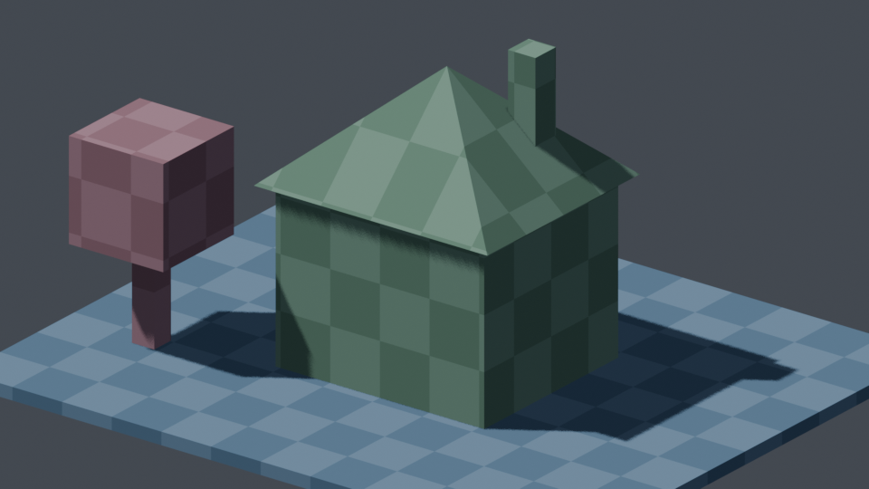

[Back to README.md](../README.md)

# Blender Examples

Explore completed Blender scenes; click a name for its project files or a thumbnail for the full render.

[Browse all prompts, Blender files and reviews](examples/README.md).

## Current visual review

[Open the side-by-side refresh gallery](examples/human-review-2026-10-03.html) for the four updated examples. It shows each preserved baseline beside its selected refresh and asks the specific visual question to review.

| Name | Comment | Image |
|---|---|---|
| [01 School Morning Character](examples/01-school-morning-character/) | Cheerful schoolboy shoulders a yellow backpack in morning light |  |
| [02 City-Corner Firehouse](examples/02-city-corner-firehouse/) | Brick firehouse anchors a quiet intersection beneath blue skies |  |
| [03 Game-Ready Treasure Chest](examples/03-game-ready-treasure-chest/) | Baked low-poly prop with GLB export |  |
| [04 Robot Greeting](examples/04-robot-greeting/) | Rigged toy robot and greeting animation |  |
| [05 Fox Sprite Sheet](examples/05-fox-sprite-sheet/) | Directional sprites rendered from editable 3D |  |
| [06 Desk Lamp from Image](examples/06-desk-lamp-from-image/) | Image-guided reconstruction with alternate views |  |
| [07 Sunlit Reading Nook](examples/07-sunlit-reading-nook/) | Furnished interior with warm window light |  |
| [08 Modular Greenhouse](examples/08-modular-greenhouse/) | Modular glasshouse with orderly rows of planting |  |
| [09 Ceramic Tea Still Life](examples/09-ceramic-tea-still-life/) | Product composition with ceramic and wood |  |
| [10 Low-Poly Island](examples/10-low-poly-island/) | Stylized coastal diorama with lighthouse |  |
| [11 Floating Forest from Sketch](examples/11-floating-forest-from-sketch/) | Pencil sketch to an editable floating forest, with a 2D target and 1920×1080 Blender render |  |
| [12 Greybox House](examples/12-greybox-house/) | Textured ground, block house with pyramid roof and chimney, and one blocky tree |  |
