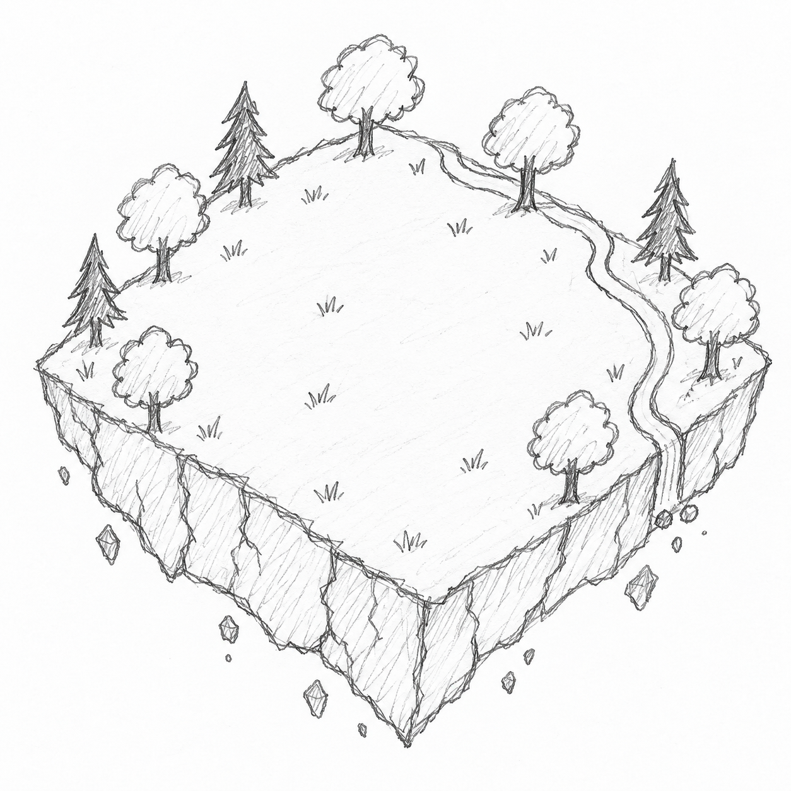

[Back to README.md](../../../README.md)

# Floating Forest from Sketch

A supplied pencil sketch reconstructed as an editable Blender environment, with a separately generated 2D visual target.

| Sketch | Blender render |
|---|---|
|  |  |

## Prompt

> Turn the supplied sketch into an editable 3D floating forest game island. Preserve its grassy clearing, perimeter trees, winding stream, and elevated three-quarter composition. Use stylized forms, realistic materials, and bright, vivid natural colors. Expose torn soil, fractured rock and roots underneath, with falling dirt and rock fragments. No skybox or ground below. Create a 2D visual target first, then deliver an editable Blender scene and a 1920×1080 PNG render.

## Files

- [Editable Blender scene](output/result.blend)
- [1920×1080 PNG render](output/result.png)
- [Original sketch](input/sketch.png)
- [Condensed prompt](input/prompt.txt)
- [AI-generated 2D target](input/visual-targets/target-01/target.png), [exact generation prompt](input/visual-targets/target-01/prompt.txt), and [direction brief](input/visual-targets/target-01/brief.md)
- [Reproducible Blender build script](input/build.py)
- [Review and comparison](output/review.md)
- [Verification manifest](output/verification.json)

## Scene and reproduction

Open `output/result.blend` and select **EX11 Floating Forest**. The scene contains separate collections for terrain, rock fractures, roots, broadleaf trees, pines, meadow, water, falling fragments, and lighting. All visible surfaces are meshes with procedural materials; there are no external texture dependencies or image billboards. The original startup scene is preserved separately.

The island is approximately 14 metres square. Its unseen underside, roots, tree backs, stream depth, and dimensions are artistic interpretations. The falling fragments are arranged in a still pose, not a physics simulation.

The final render uses Blender 5.2.2 LTS, Cycles, 96 samples, OptiX on an RTX 4070 Laptop GPU, denoising, and AgX Medium High Contrast. The world uses a plain neutral background with no skybox and no ground plane. Seed: `291126`.

To rebuild through the official Blender MCP connection, execute `input/build.py` with `__file__` set to its absolute path. It replaces only its owned `EX11 Floating Forest` scene, writes `output/result.blend`, and sets up the final render; invoke `bpy.ops.render.render(write_still=True)` afterward to write the PNG. OptiX is selected when available, otherwise rendering uses the CPU. Do not launch an unsuppressed helper or background Blender process on Windows.

This is a detailed editable environment and render example, not an optimized game export: approximately 1.15 million mesh polygons and 1,466 scene objects. Engine integration, collision, traversal, LODs, and performance have not been tested. See the review for remaining visual differences from the target.
