[Back to README.md](../../README.md)

# Blender examples

Eleven integrated workflows, ready for visual review. Click a render to open it at full size. Examples 03–10 each use one creative iteration; review notes identify remaining artistic issues. Examples 03–10 use 1280×720 main renders with a soft target below 30 seconds. Example 11 delivers a 1920×1080 sketch-to-3D render after two correction passes.

See the [style coverage map](style-coverage.md) for the intended and observed look of each example and the initial refresh candidates.

## Current visual review

[Open the side-by-side refresh gallery](human-review-2026-10-03.html) to review examples 02, 03, 07, and 08. It compares each selected refresh against its preserved baseline and states the visible decision to make.

| Name | Image | Files |
|---|---|---|
| [01 — School Morning Character](01-school-morning-character/) | <a href="01-school-morning-character/output/result.png">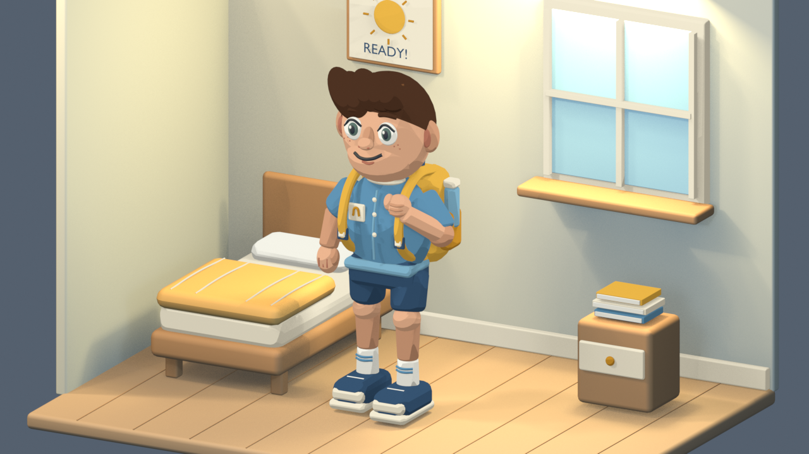</a> | [Prompt](01-school-morning-character/input/prompt.txt) · [Render](01-school-morning-character/output/result.png) · [Blend](01-school-morning-character/output/result.blend) · [Editor](01-school-morning-character/output/editor.png) · [Review](01-school-morning-character/output/review.md) |
| [02 — City-Corner Firehouse](02-city-corner-firehouse/) | <a href="02-city-corner-firehouse/output/result.png">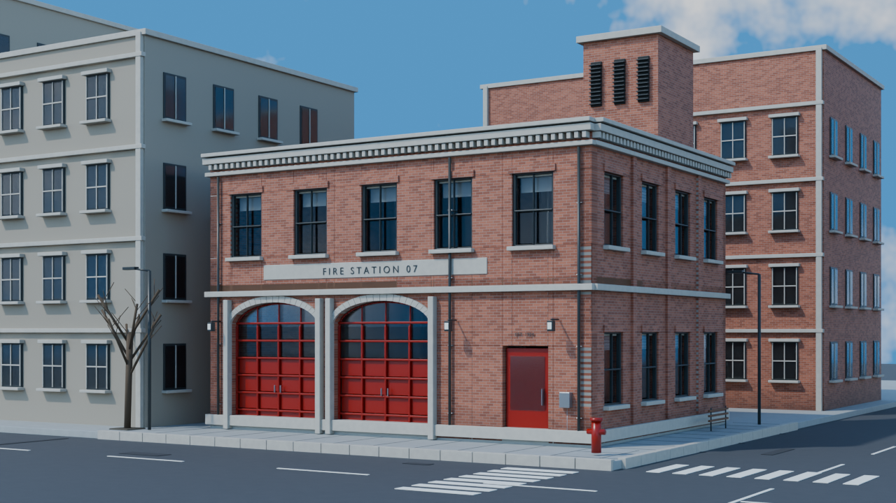</a> | [Prompt](02-city-corner-firehouse/input/prompt.txt) · [Render](02-city-corner-firehouse/output/result.png) · [Blend](02-city-corner-firehouse/output/result.blend) · [Editor](02-city-corner-firehouse/output/editor.png) · [Review](02-city-corner-firehouse/output/review.md) |
| [03 — Game-Ready Treasure Chest](03-game-ready-treasure-chest/) | <a href="03-game-ready-treasure-chest/output/result.png">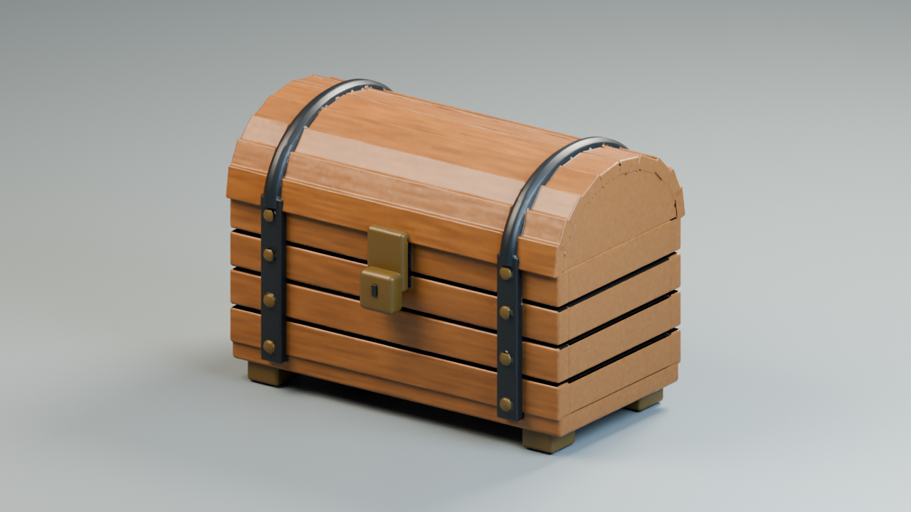</a> | [Prompt](03-game-ready-treasure-chest/input/prompt.txt) · [Render](03-game-ready-treasure-chest/output/result.png) · [Blend](03-game-ready-treasure-chest/output/result.blend) · [Editor](03-game-ready-treasure-chest/output/editor.png) · [Review](03-game-ready-treasure-chest/output/review.md) |
| [04 — Robot Greeting](04-robot-greeting/) | <a href="04-robot-greeting/output/result.png">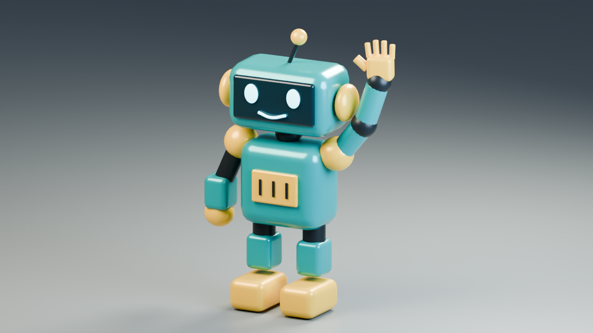</a> | [Prompt](04-robot-greeting/input/prompt.txt) · [Render](04-robot-greeting/output/result.png) · [Blend](04-robot-greeting/output/result.blend) · [Editor](04-robot-greeting/output/editor.png) · [Review](04-robot-greeting/output/review.md) |
| [05 — Fox Sprite Sheet](05-fox-sprite-sheet/) | <a href="05-fox-sprite-sheet/output/result.png">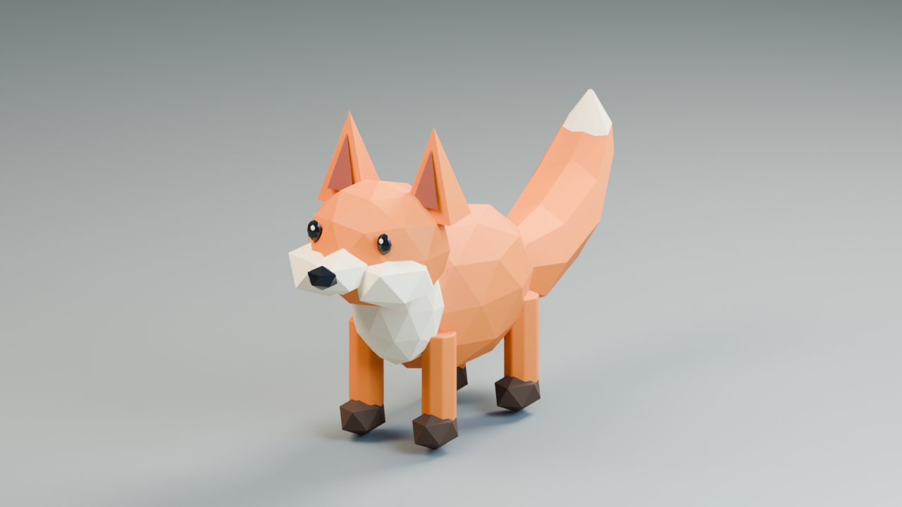</a> | [Prompt](05-fox-sprite-sheet/input/prompt.txt) · [Render](05-fox-sprite-sheet/output/result.png) · [Blend](05-fox-sprite-sheet/output/result.blend) · [Editor](05-fox-sprite-sheet/output/editor.png) · [Review](05-fox-sprite-sheet/output/review.md) |
| [06 — Desk Lamp from Image](06-desk-lamp-from-image/) | <a href="06-desk-lamp-from-image/output/result.png">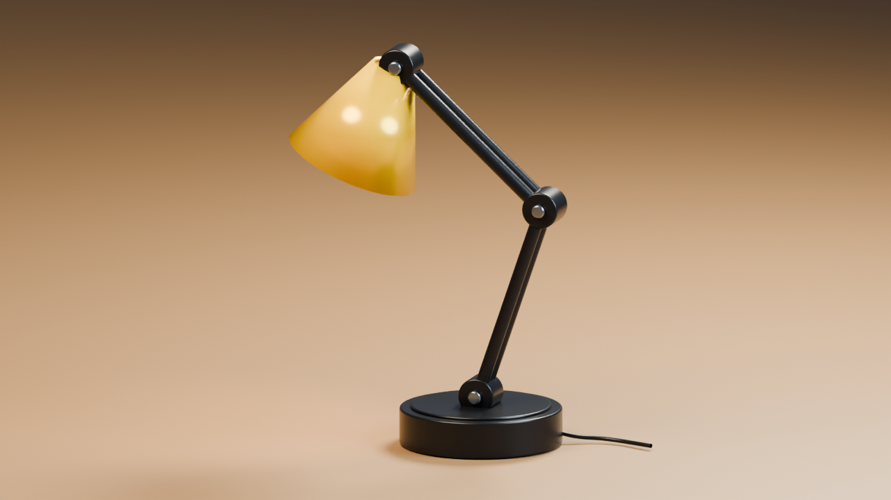</a> | [Prompt](06-desk-lamp-from-image/input/prompt.txt) · [Render](06-desk-lamp-from-image/output/result.png) · [Blend](06-desk-lamp-from-image/output/result.blend) · [Editor](06-desk-lamp-from-image/output/editor.png) · [Review](06-desk-lamp-from-image/output/review.md) |
| [07 — Sunlit Reading Nook](07-sunlit-reading-nook/) | <a href="07-sunlit-reading-nook/output/result.png">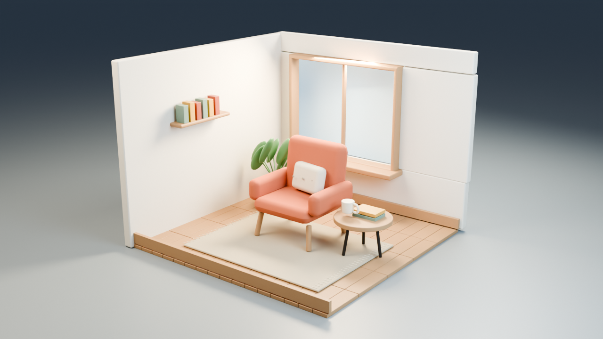</a> | [Prompt](07-sunlit-reading-nook/input/prompt.txt) · [Render](07-sunlit-reading-nook/output/result.png) · [Blend](07-sunlit-reading-nook/output/result.blend) · [Editor](07-sunlit-reading-nook/output/editor.png) · [Review](07-sunlit-reading-nook/output/review.md) |
| [08 — Modular Greenhouse](08-modular-greenhouse/) | <a href="08-modular-greenhouse/output/result.png">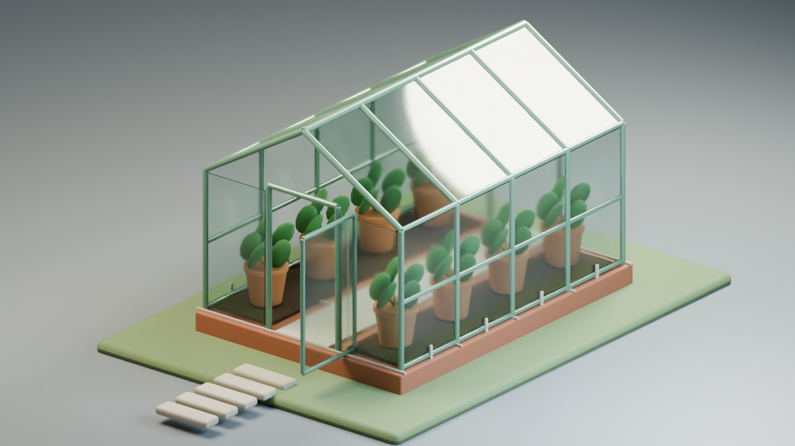</a> | [Prompt](08-modular-greenhouse/input/prompt.txt) · [Render](08-modular-greenhouse/output/result.png) · [Blend](08-modular-greenhouse/output/result.blend) · [Editor](08-modular-greenhouse/output/editor.png) · [Review](08-modular-greenhouse/output/review.md) |
| [09 — Ceramic Tea Still Life](09-ceramic-tea-still-life/) | <a href="09-ceramic-tea-still-life/output/result.png">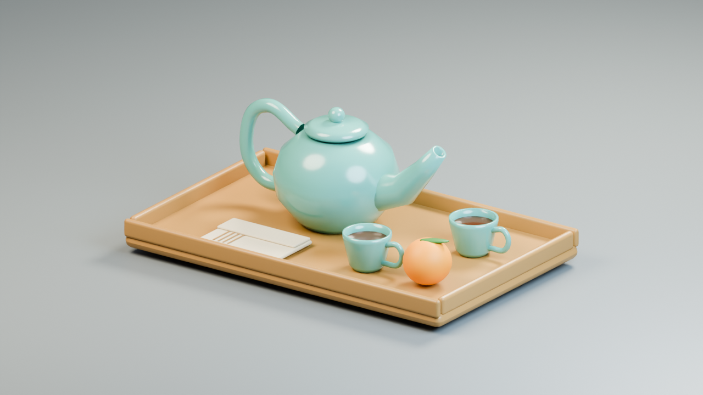</a> | [Prompt](09-ceramic-tea-still-life/input/prompt.txt) · [Render](09-ceramic-tea-still-life/output/result.png) · [Blend](09-ceramic-tea-still-life/output/result.blend) · [Editor](09-ceramic-tea-still-life/output/editor.png) · [Review](09-ceramic-tea-still-life/output/review.md) |
| [10 — Low-Poly Island](10-low-poly-island/) | <a href="10-low-poly-island/output/result.png">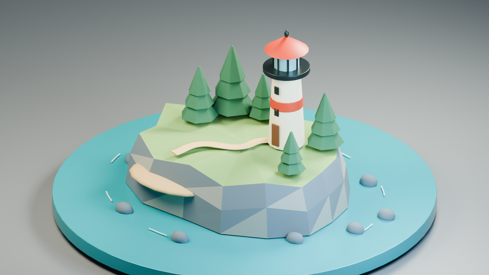</a> | [Prompt](10-low-poly-island/input/prompt.txt) · [Render](10-low-poly-island/output/result.png) · [Blend](10-low-poly-island/output/result.blend) · [Editor](10-low-poly-island/output/editor.png) · [Review](10-low-poly-island/output/review.md) |

| [11 — Floating Forest from Sketch](11-floating-forest-from-sketch/) | <a href="11-floating-forest-from-sketch/output/result.png">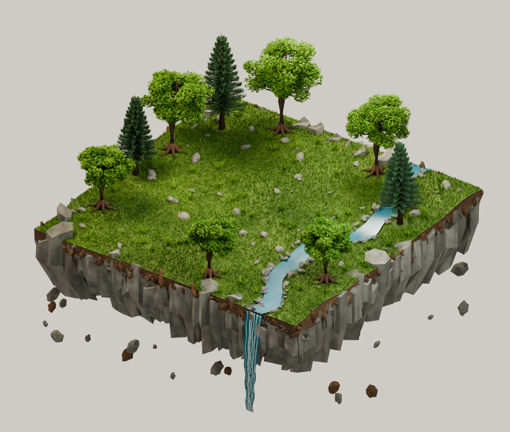</a> | [Sketch](11-floating-forest-from-sketch/input/sketch.png) · [Prompt](11-floating-forest-from-sketch/input/prompt.txt) · [Target](11-floating-forest-from-sketch/input/visual-targets/target-01/target.png) · [Blend](11-floating-forest-from-sketch/output/result.blend) · [Review](11-floating-forest-from-sketch/output/review.md) |

## Layout and reproduction

Each numbered example stores prompts, build source and optional visual targets in `input/`, and Blender results, screenshots and review evidence in `output/`. Example 02 follows the same input/output layout and retains only its selected final firehouse version.

`_shared/build_common.py` supplies common modeling, lighting and save helpers for examples 03–10. Open a result.blend to inspect its editable scene. To rebuild, use the verified official MCP with the full repository available and execute the example's input/build.py with its `__file__` set to that path. Builds create an owned scene and overwrite that example's output files; checkpoint other work first. The scripts currently select OptiX GPU explicitly, so hardware/settings must be adapted on systems without OptiX. They are reproducible source, not an installer or universal batch runner.

Saved scenes contain their required assets; helper source is separate from asset portability. Embedded build text records the original run; use the external input/build.py for the current checkout-independent launcher. Screenshots show the render inside Blender with editor panels. They were captured only after fresh visible/non-minimized window checks. Generated visual targets are inspiration, not delivered 3D renders.

## Skill coverage

All examples exercise setup, materials, lighting/camera, rendering and review. Model creation is shown by the character, chest, robot, fox, lamp and still life; environment creation by the firehouse, nook, greenhouse and island. Procedural geometry is checked in the firehouse and greenhouse. The chest exercises UV/baking and GLB export; the robot adds rigging/animation and animated export; the fox converts 3D to sprites; the lamp reconstructs 3D from 2D. Examples 03–10 add prompt-specific visual targets (the lamp reuses its supplied image), covering all fourteen skills in concert.

See [verification.json](verification.json) for file and image checks. Reviews distinguish technical evidence from pending artistic approval. No target-engine compatibility is implied by Blender GLB reimport.
