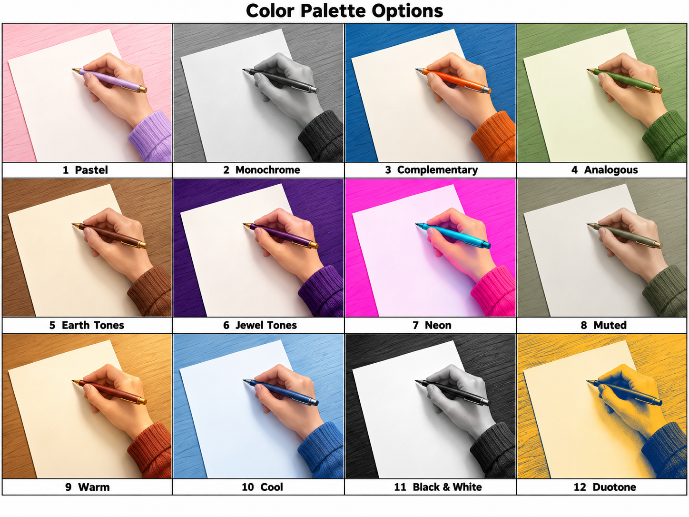
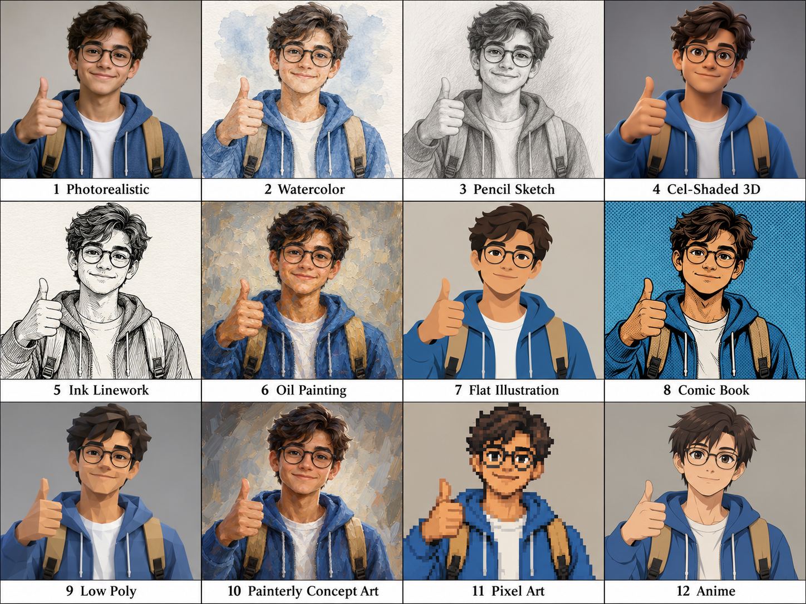
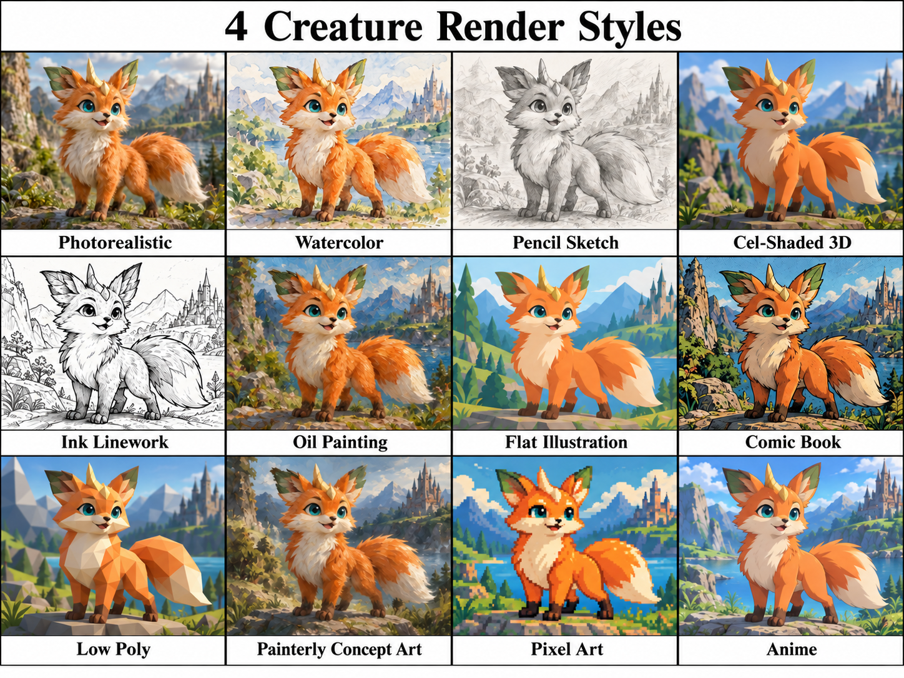
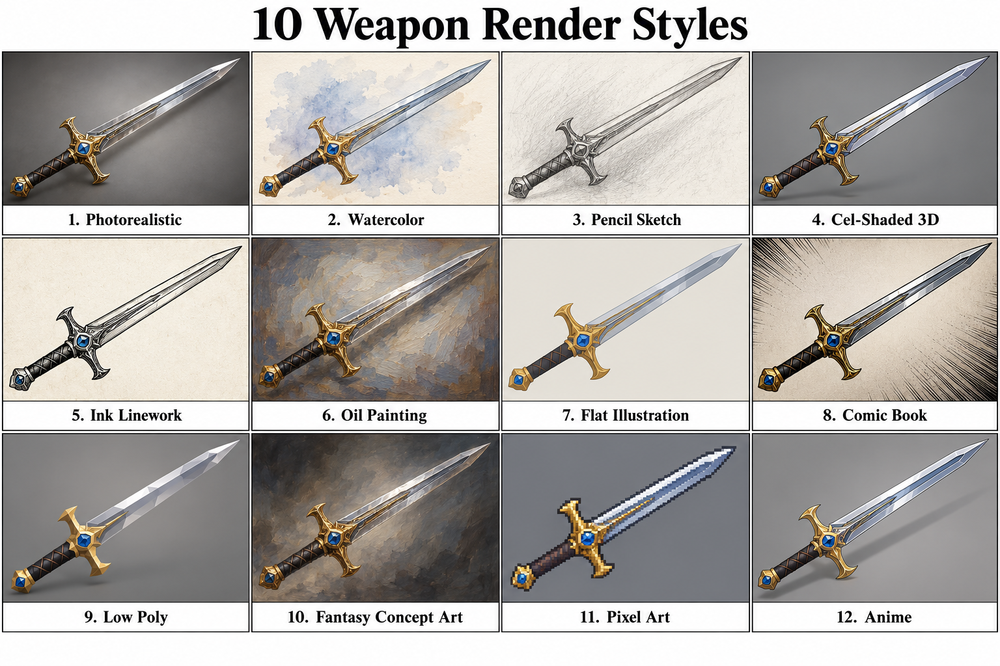
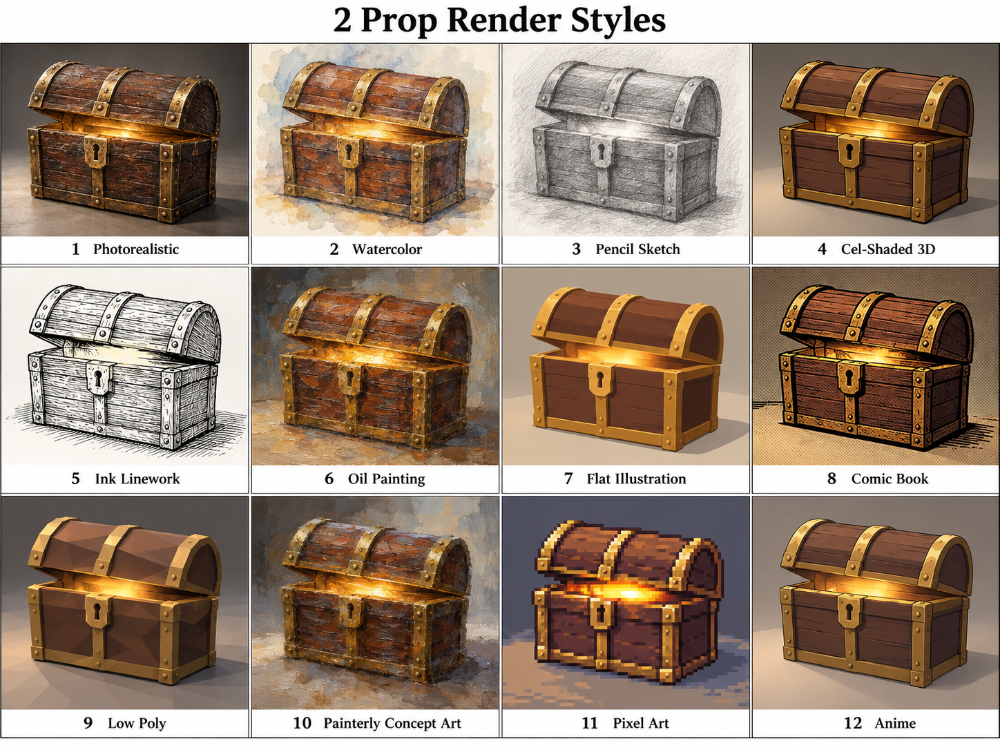

[Back to README.md](../README.md)

# Visual References

Compare camera angles, color palettes, lighting, and rendering styles; click any thumbnail to open the full image.

| Name | Comment | Image |
|---|---|---|
| Camera Angles V1 | Rainy street portraits explore framing, elevation, and perspective |  |
| Colors Hand V1 | Drawing hands demonstrate palettes from pastel to neon |  |
| Colors Leaves V1 | Autumn leaves reveal how palettes transform familiar shapes |  |
| Lighting Character V1 | One character reveals twelve contrasting moods through lighting |  |
| Render Architecture V1 | Modern white homes shift between realistic and illustrative finishes |  |
| Render Car V1 | Turquoise compact cars compare painterly and graphic treatments |  |
| Render Character V1 | Smiling portraits translate glasses and curls across styles |  |
| Render Character V2 | Full body character studies compare silhouettes and surface detail |  |
| Render Desk Lamp V1 | Yellow desk lamps explore shading, texture, and abstraction |  |
| Render Desk Lamp V2 | Articulated lamps compare polished surfaces with expressive marks |  |
| Render Food V1 | Burgers and fries test appetizing textures across media |  |
| Render Food V2 | Plated burgers balance crisp outlines and warm highlights |  |
| Render Forest V1 | Sunlit forest paths transition between naturalism and stylization |  |
| Render Fox V1 | Orange woodland foxes compare fur detail and simplified forms |  |
| Render Fox V2 | Large eared foxes explore expressive shapes and brushwork |  |
| Render Interior V1 | Bright living rooms compare cozy materials and illustration techniques |  |
| Render Landscape V1 | Alpine lakes reflect mountains across twelve visual treatments |  |
| Render Robot V1 | Mechanical walkers mix rounded armor with varied rendering styles |  |
| Render Sword V1 | Ornate swords contrast metallic highlights with graphic simplification |  |
| Render Treasure Chest V1 | Wooden treasure chests explore brass trim and weathered surfaces |  |
