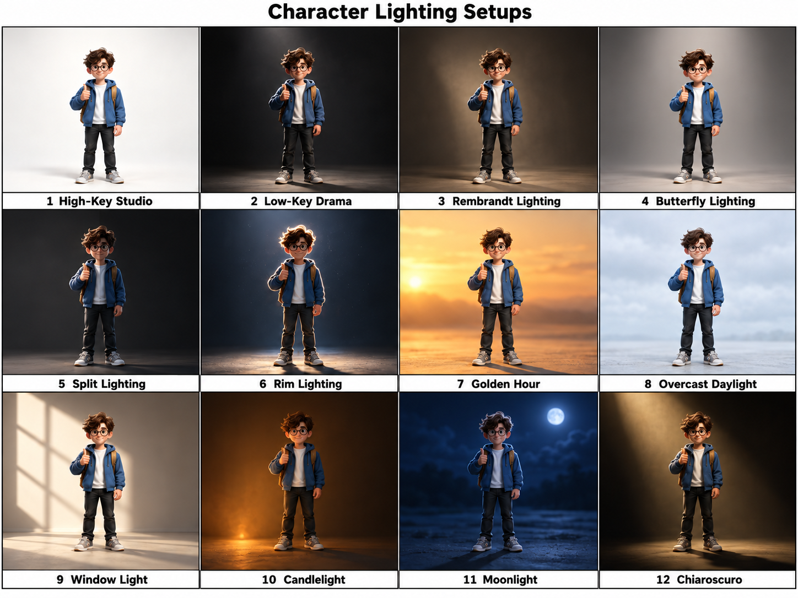

# Lighting references

[Gallery index](../README.md). User-supplied files; creator and license unknown. Inspect images before interpreting style.

## lighting character v1

File: `lighting_character_v1.png`. Source/credit: not supplied.
