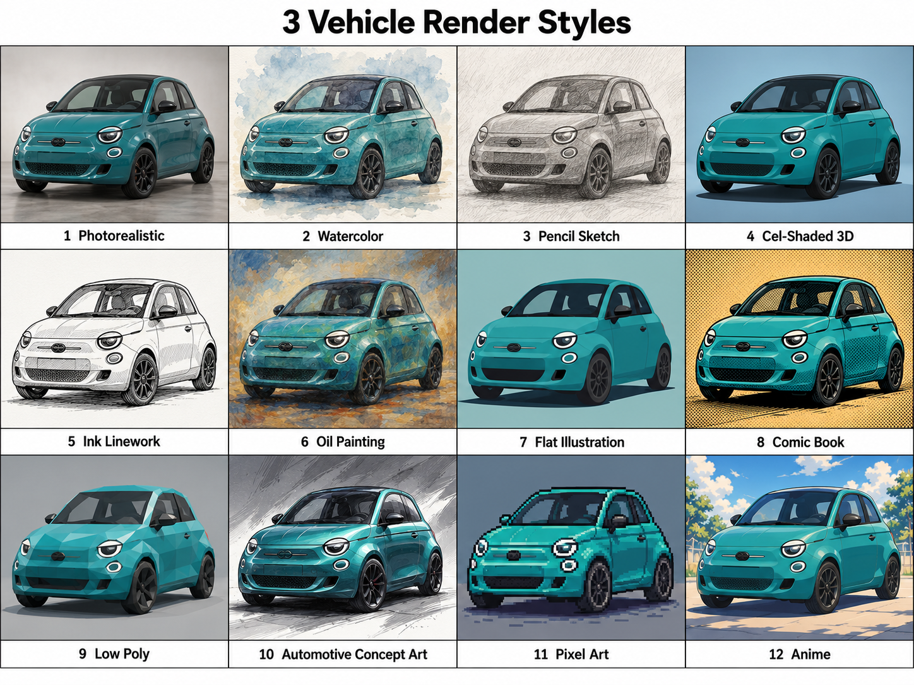
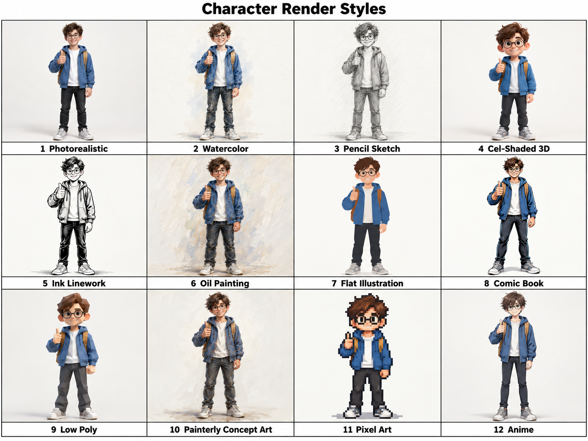
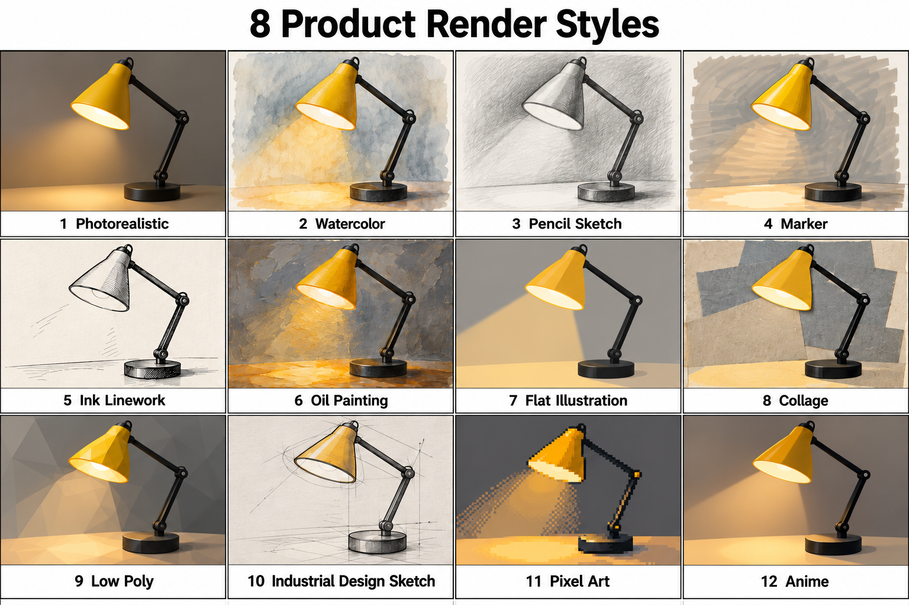
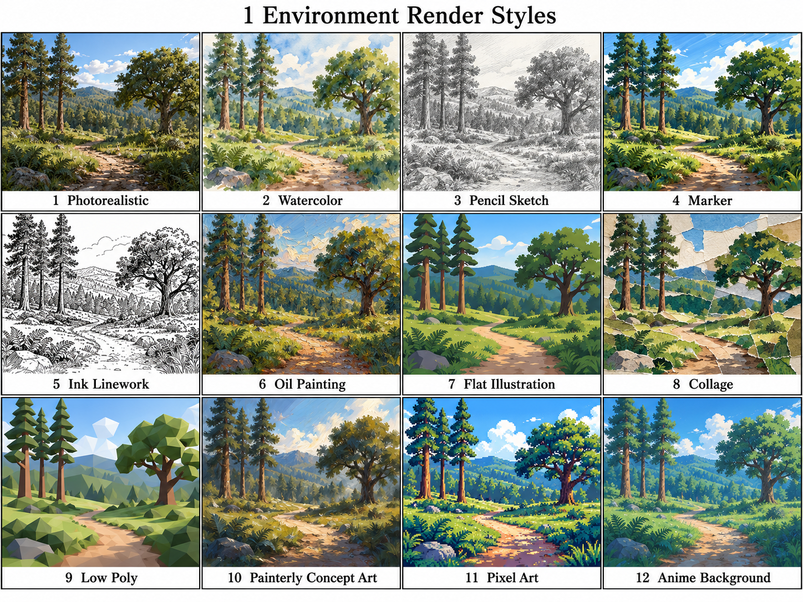

# Renders references

[Gallery index](../README.md). User-supplied files; creator and license unknown. Inspect images before interpreting style.

## render architecture v1

File: `render_architecture_v1.png`. Source/credit: not supplied.

## render car v1

File: `render_car_v1.png`. Source/credit: not supplied.

## render character v1

File: `render_character_v1.png`. Source/credit: not supplied.

## render character v2

File: `render_character_v2.png`. Source/credit: not supplied.

## render desk lamp v1

File: `render_desk_lamp_v1.png`. Source/credit: not supplied.

## render desk lamp v2

File: `render_desk_lamp_v2.png`. Source/credit: not supplied.

## render food v1

File: `render_food_v1.png`. Source/credit: not supplied.

## render food v2

File: `render_food_v2.png`. Source/credit: not supplied.

## render forest v1

File: `render_forest_v1.png`. Source/credit: not supplied.

## render fox v1

File: `render_fox_v1.png`. Source/credit: not supplied.

## render fox v2

File: `render_fox_v2.png`. Source/credit: not supplied.

## render interior v1

File: `render_interior_v1.png`. Source/credit: not supplied.

## render landscape v1

File: `render_landscape_v1.png`. Source/credit: not supplied.

## render robot v1

File: `render_robot_v1.png`. Source/credit: not supplied.

## render sword v1

File: `render_sword_v1.png`. Source/credit: not supplied.

## render treasure chest v1

File: `render_treasure_chest_v1.png`. Source/credit: not supplied.
